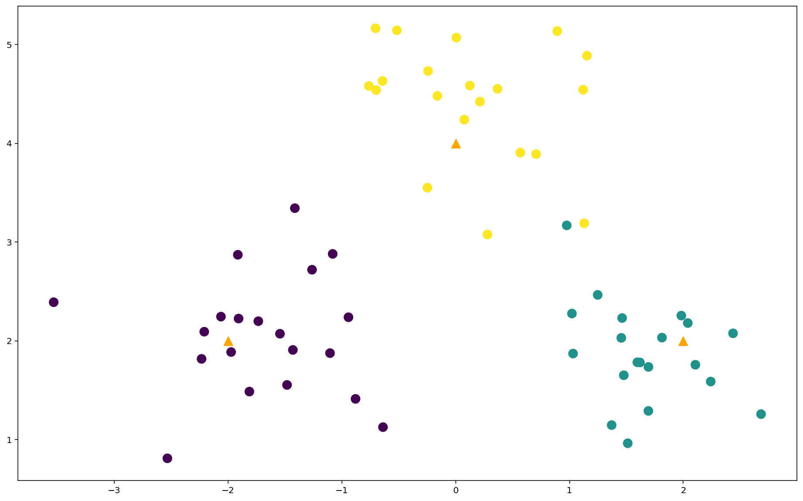
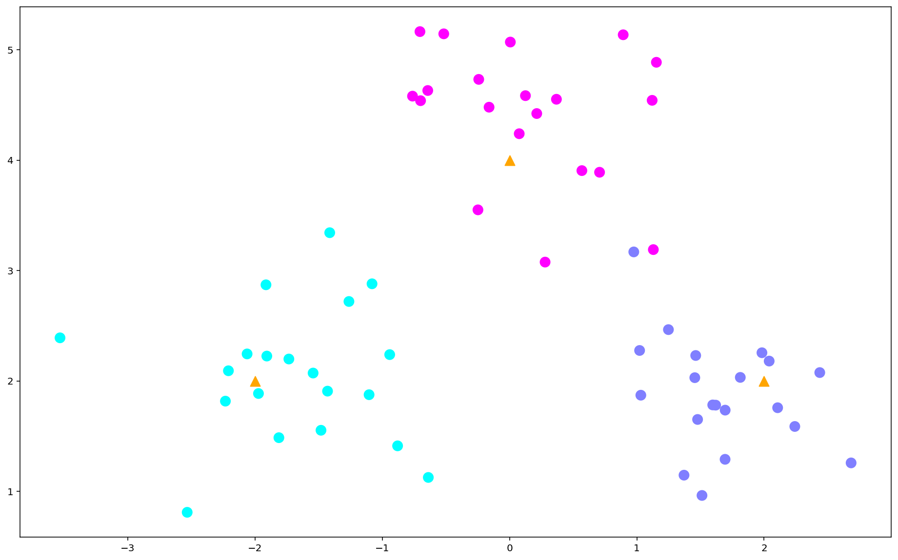
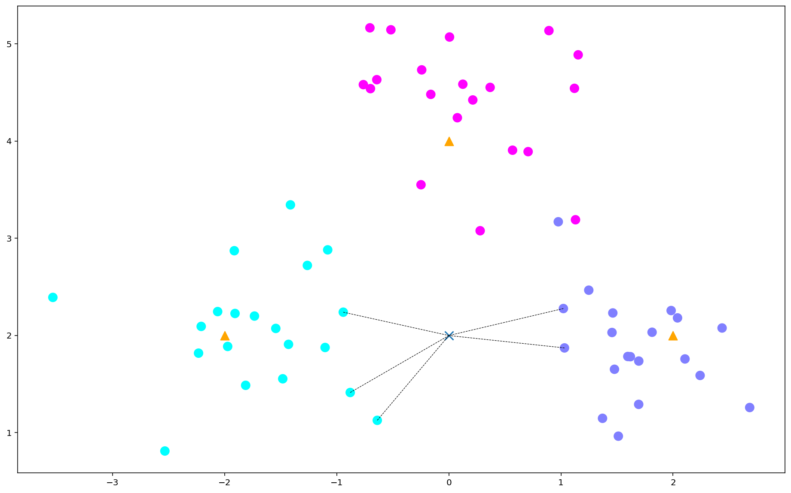

### RGBA： A代表透明度

### 假设一个图片的像素值是4x4，那么用RGB值去表示这个图片，需要用到多少个int值？
~~~
4x4x3=48

~~~

### K最近邻算法（KNN）


### KNN学习步骤


不标记样本的类别，由距离其最近的K个邻居投票来决定，所以K值得选择比较关键


过拟合：训练的时候表现不错，但是测试的时候就不行了
欠拟合：在哪表现都不好

### 使用KNN进行分类


```python
"""
pip install sklearn
"""
from sklearn.datasets.samples_generator import make_blobs
centers = [[-2,2],[2,2],[0,4]]
#生成数据
x,y = make_blobs(n_samples=60,centers=centers,random_state=0,cluster_std=0.6)
    #生成60个数据围绕着centers
    #cluster_std 稀疏程度

```


```python
x
```


    array([[ 1.59652373,  1.7842681 ],
           [-1.08033247,  2.88161526],
           [-2.20874729,  2.09380938],
           [ 2.68364041,  1.25910451],
           [-1.54337736,  2.07300501],
           [ 1.45562098,  2.03116724],
           [ 1.02188099,  2.27766935],
           [-1.90703154,  2.22689751],
           [ 0.36844762,  4.553324  ],
           [-0.24817139,  3.55152711],
           [-1.26182559,  2.72142791],
           [-2.53267145,  0.81152212],
           [-0.762291  ,  4.58163802],
           [ 0.12496499,  4.58598342],
           [-0.24190617,  4.73346704],
           [ 0.56835118,  3.90699394],
           [-0.94156859,  2.24009433],
           [-2.06193131,  2.2463591 ],
           [-1.10355256,  1.87690504],
           [-1.91357386,  2.8725641 ],
           [ 1.03166129,  1.87235583],
           [ 1.69420869,  1.73715542],
           [ 0.00630001,  5.0715223 ],
           [-0.63814723,  1.1273806 ],
           [-1.41275721,  3.34453592],
           [ 0.97623789,  3.17046524],
           [ 0.89295132,  5.13753351],
           [-1.73368206,  2.2002046 ],
           [-1.97254489,  1.88768969],
           [ 1.12989042,  3.19134456],
           [ 1.12053538,  4.54362679],
           [-0.70387404,  5.16617271],
           [ 1.51211223,  0.96423044],
           [ 0.07614726,  4.24119362],
           [ 1.69351692,  1.29162069],
           [ 0.27939746,  3.07825379],
           [-0.64245157,  4.63267104],
           [ 1.47752171,  1.6526902 ],
           [-1.81215938,  1.48754256],
           [ 1.81306848,  2.03369921],
           [ 2.43745434,  2.07738975],
           [-1.42994695,  1.90918568],
           [ 1.61940674,  1.7823553 ],
           [-0.51673541,  5.14603897],
           [ 1.24832278,  2.46649421],
           [ 1.46272006,  2.2321415 ],
           [-2.23239609,  1.81861835],
           [ 1.98309066,  2.25699912],
           [-0.87946521,  1.41363327],
           [-0.16080202,  4.48147384],
           [ 0.21381984,  4.4239439 ],
           [ 2.03991033,  2.18148314],
           [ 2.24140498,  1.58911395],
           [ 0.70726774,  3.8920451 ],
           [ 1.15376522,  4.88830887],
           [-3.53179389,  2.39217116],
           [ 1.37086822,  1.14798924],
           [-0.6990899 ,  4.54049589],
           [-1.48133828,  1.55470099],
           [ 2.10645569,  1.75893144]])


```python
y
```


    array([1, 0, 0, 1, 0, 1, 1, 0, 2, 2, 0, 0, 2, 2, 2, 2, 0, 0, 0, 0, 1, 1,
           2, 0, 0, 1, 2, 0, 0, 2, 2, 2, 1, 2, 1, 2, 2, 1, 0, 1, 1, 0, 1, 2,
           1, 1, 0, 1, 0, 2, 2, 1, 1, 2, 2, 0, 1, 2, 0, 1])


```python
#把数据画出来
#pip install matplotlib
import matplotlib.pyplot as plt
import numpy as np
```


```python
x[:,0]
```


    array([ 1.59652373, -1.08033247, -2.20874729,  2.68364041, -1.54337736,
            1.45562098,  1.02188099, -1.90703154,  0.36844762, -0.24817139,
           -1.26182559, -2.53267145, -0.762291  ,  0.12496499, -0.24190617,
            0.56835118, -0.94156859, -2.06193131, -1.10355256, -1.91357386,
            1.03166129,  1.69420869,  0.00630001, -0.63814723, -1.41275721,
            0.97623789,  0.89295132, -1.73368206, -1.97254489,  1.12989042,
            1.12053538, -0.70387404,  1.51211223,  0.07614726,  1.69351692,
            0.27939746, -0.64245157,  1.47752171, -1.81215938,  1.81306848,
            2.43745434, -1.42994695,  1.61940674, -0.51673541,  1.24832278,
            1.46272006, -2.23239609,  1.98309066, -0.87946521, -0.16080202,
            0.21381984,  2.03991033,  2.24140498,  0.70726774,  1.15376522,
           -3.53179389,  1.37086822, -0.6990899 , -1.48133828,  2.10645569])


```python
plt.figure(figsize=(16,10),dpi=144)
center_array = np.array(centers)
#把x中的第0列和第1列分别取出来,c:颜色，s:大小，cmap:样式
plt.scatter(x[:,0],x[:,1],c=y,s=100) 
plt.scatter(center_array[:,0],center_array[:,1],s=100,marker="^",c="orange")
```


    <matplotlib.collections.PathCollection at 0x206a5e6fb38>





```python
plt.figure(figsize=(16,10),dpi=144)
center_array = np.array(centers)
#把x中的第0列和第1列分别取出来,c:颜色，s:大小，cmap:样式
plt.scatter(x[:,0],x[:,1],c=y,s=100,cmap="cool") 
plt.scatter(center_array[:,0],center_array[:,1],s=100,marker="^",c="orange")
```


    <matplotlib.collections.PathCollection at 0x206a766cda0>





```python
from sklearn.neighbors import KNeighborsClassifier
clf = KNeighborsClassifier(n_neighbors=5) #创建一个k=5的KNN分类器
clf.fit(x,y) #训练
```


    KNeighborsClassifier(algorithm='auto', leaf_size=30, metric='minkowski',
                         metric_params=None, n_jobs=None, n_neighbors=5, p=2,
                         weights='uniform')


```python
#对样本进行预测
x_sample = [[0,2]] #sklearn 必须以这样二维的方式创建点，否则会报错
#使用模型进行预测
neighbors = clf.kneighbors(x_sample,return_distance=False) #默认用欧氏距离来找
print(neighbors[0])
```

    [16 20 48  6 23]
    


```python
#画图
plt.figure(figsize=(16,10),dpi=144)
plt.scatter(x[:,0],x[:,1],c=y,s=100,cmap='cool')
plt.scatter(center_array[:,0],center_array[:,1],s=100,marker="^",c="orange")
plt.scatter(x_sample[0][0],x_sample[0][1],s=100,marker="x",cmap="cool")
for i in neighbors[0]:
    plt.plot([x[i][0],x_sample[0][0]],[x[i][1],x_sample[0][1]],'k--',linewidth=0.6)
```





```python
from sklearn.datasets import load_iris
iris = load_iris()
iris_data = iris.data
iris_data #花的特征点：花瓣的长度datasetsetc.
```


    array([[5.1, 3.5, 1.4, 0.2],
           [4.9, 3. , 1.4, 0.2],
           [4.7, 3.2, 1.3, 0.2],
           [4.6, 3.1, 1.5, 0.2],
           [5. , 3.6, 1.4, 0.2],
           [5.4, 3.9, 1.7, 0.4],
           [4.6, 3.4, 1.4, 0.3],
           [5. , 3.4, 1.5, 0.2],
           [4.4, 2.9, 1.4, 0.2],
           [4.9, 3.1, 1.5, 0.1],
           [5.4, 3.7, 1.5, 0.2],
           [4.8, 3.4, 1.6, 0.2],
           [4.8, 3. , 1.4, 0.1],
           [4.3, 3. , 1.1, 0.1],
           [5.8, 4. , 1.2, 0.2],
           [5.7, 4.4, 1.5, 0.4],
           [5.4, 3.9, 1.3, 0.4],
           [5.1, 3.5, 1.4, 0.3],
           [5.7, 3.8, 1.7, 0.3],
           [5.1, 3.8, 1.5, 0.3],
           [5.4, 3.4, 1.7, 0.2],
           [5.1, 3.7, 1.5, 0.4],
           [4.6, 3.6, 1. , 0.2],
           [5.1, 3.3, 1.7, 0.5],
           [4.8, 3.4, 1.9, 0.2],
           [5. , 3. , 1.6, 0.2],
           [5. , 3.4, 1.6, 0.4],
           [5.2, 3.5, 1.5, 0.2],
           [5.2, 3.4, 1.4, 0.2],
           [4.7, 3.2, 1.6, 0.2],
           [4.8, 3.1, 1.6, 0.2],
           [5.4, 3.4, 1.5, 0.4],
           [5.2, 4.1, 1.5, 0.1],
           [5.5, 4.2, 1.4, 0.2],
           [4.9, 3.1, 1.5, 0.2],
           [5. , 3.2, 1.2, 0.2],
           [5.5, 3.5, 1.3, 0.2],
           [4.9, 3.6, 1.4, 0.1],
           [4.4, 3. , 1.3, 0.2],
           [5.1, 3.4, 1.5, 0.2],
           [5. , 3.5, 1.3, 0.3],
           [4.5, 2.3, 1.3, 0.3],
           [4.4, 3.2, 1.3, 0.2],
           [5. , 3.5, 1.6, 0.6],
           [5.1, 3.8, 1.9, 0.4],
           [4.8, 3. , 1.4, 0.3],
           [5.1, 3.8, 1.6, 0.2],
           [4.6, 3.2, 1.4, 0.2],
           [5.3, 3.7, 1.5, 0.2],
           [5. , 3.3, 1.4, 0.2],
           [7. , 3.2, 4.7, 1.4],
           [6.4, 3.2, 4.5, 1.5],
           [6.9, 3.1, 4.9, 1.5],
           [5.5, 2.3, 4. , 1.3],
           [6.5, 2.8, 4.6, 1.5],
           [5.7, 2.8, 4.5, 1.3],
           [6.3, 3.3, 4.7, 1.6],
           [4.9, 2.4, 3.3, 1. ],
           [6.6, 2.9, 4.6, 1.3],
           [5.2, 2.7, 3.9, 1.4],
           [5. , 2. , 3.5, 1. ],
           [5.9, 3. , 4.2, 1.5],
           [6. , 2.2, 4. , 1. ],
           [6.1, 2.9, 4.7, 1.4],
           [5.6, 2.9, 3.6, 1.3],
           [6.7, 3.1, 4.4, 1.4],
           [5.6, 3. , 4.5, 1.5],
           [5.8, 2.7, 4.1, 1. ],
           [6.2, 2.2, 4.5, 1.5],
           [5.6, 2.5, 3.9, 1.1],
           [5.9, 3.2, 4.8, 1.8],
           [6.1, 2.8, 4. , 1.3],
           [6.3, 2.5, 4.9, 1.5],
           [6.1, 2.8, 4.7, 1.2],
           [6.4, 2.9, 4.3, 1.3],
           [6.6, 3. , 4.4, 1.4],
           [6.8, 2.8, 4.8, 1.4],
           [6.7, 3. , 5. , 1.7],
           [6. , 2.9, 4.5, 1.5],
           [5.7, 2.6, 3.5, 1. ],
           [5.5, 2.4, 3.8, 1.1],
           [5.5, 2.4, 3.7, 1. ],
           [5.8, 2.7, 3.9, 1.2],
           [6. , 2.7, 5.1, 1.6],
           [5.4, 3. , 4.5, 1.5],
           [6. , 3.4, 4.5, 1.6],
           [6.7, 3.1, 4.7, 1.5],
           [6.3, 2.3, 4.4, 1.3],
           [5.6, 3. , 4.1, 1.3],
           [5.5, 2.5, 4. , 1.3],
           [5.5, 2.6, 4.4, 1.2],
           [6.1, 3. , 4.6, 1.4],
           [5.8, 2.6, 4. , 1.2],
           [5. , 2.3, 3.3, 1. ],
           [5.6, 2.7, 4.2, 1.3],
           [5.7, 3. , 4.2, 1.2],
           [5.7, 2.9, 4.2, 1.3],
           [6.2, 2.9, 4.3, 1.3],
           [5.1, 2.5, 3. , 1.1],
           [5.7, 2.8, 4.1, 1.3],
           [6.3, 3.3, 6. , 2.5],
           [5.8, 2.7, 5.1, 1.9],
           [7.1, 3. , 5.9, 2.1],
           [6.3, 2.9, 5.6, 1.8],
           [6.5, 3. , 5.8, 2.2],
           [7.6, 3. , 6.6, 2.1],
           [4.9, 2.5, 4.5, 1.7],
           [7.3, 2.9, 6.3, 1.8],
           [6.7, 2.5, 5.8, 1.8],
           [7.2, 3.6, 6.1, 2.5],
           [6.5, 3.2, 5.1, 2. ],
           [6.4, 2.7, 5.3, 1.9],
           [6.8, 3. , 5.5, 2.1],
           [5.7, 2.5, 5. , 2. ],
           [5.8, 2.8, 5.1, 2.4],
           [6.4, 3.2, 5.3, 2.3],
           [6.5, 3. , 5.5, 1.8],
           [7.7, 3.8, 6.7, 2.2],
           [7.7, 2.6, 6.9, 2.3],
           [6. , 2.2, 5. , 1.5],
           [6.9, 3.2, 5.7, 2.3],
           [5.6, 2.8, 4.9, 2. ],
           [7.7, 2.8, 6.7, 2. ],
           [6.3, 2.7, 4.9, 1.8],
           [6.7, 3.3, 5.7, 2.1],
           [7.2, 3.2, 6. , 1.8],
           [6.2, 2.8, 4.8, 1.8],
           [6.1, 3. , 4.9, 1.8],
           [6.4, 2.8, 5.6, 2.1],
           [7.2, 3. , 5.8, 1.6],
           [7.4, 2.8, 6.1, 1.9],
           [7.9, 3.8, 6.4, 2. ],
           [6.4, 2.8, 5.6, 2.2],
           [6.3, 2.8, 5.1, 1.5],
           [6.1, 2.6, 5.6, 1.4],
           [7.7, 3. , 6.1, 2.3],
           [6.3, 3.4, 5.6, 2.4],
           [6.4, 3.1, 5.5, 1.8],
           [6. , 3. , 4.8, 1.8],
           [6.9, 3.1, 5.4, 2.1],
           [6.7, 3.1, 5.6, 2.4],
           [6.9, 3.1, 5.1, 2.3],
           [5.8, 2.7, 5.1, 1.9],
           [6.8, 3.2, 5.9, 2.3],
           [6.7, 3.3, 5.7, 2.5],
           [6.7, 3. , 5.2, 2.3],
           [6.3, 2.5, 5. , 1.9],
           [6.5, 3. , 5.2, 2. ],
           [6.2, 3.4, 5.4, 2.3],
           [5.9, 3. , 5.1, 1.8]])


```python
iris_target = iris.target
iris_target #标识类别
```


    array([0, 0, 0, 0, 0, 0, 0, 0, 0, 0, 0, 0, 0, 0, 0, 0, 0, 0, 0, 0, 0, 0,
           0, 0, 0, 0, 0, 0, 0, 0, 0, 0, 0, 0, 0, 0, 0, 0, 0, 0, 0, 0, 0, 0,
           0, 0, 0, 0, 0, 0, 1, 1, 1, 1, 1, 1, 1, 1, 1, 1, 1, 1, 1, 1, 1, 1,
           1, 1, 1, 1, 1, 1, 1, 1, 1, 1, 1, 1, 1, 1, 1, 1, 1, 1, 1, 1, 1, 1,
           1, 1, 1, 1, 1, 1, 1, 1, 1, 1, 1, 1, 2, 2, 2, 2, 2, 2, 2, 2, 2, 2,
           2, 2, 2, 2, 2, 2, 2, 2, 2, 2, 2, 2, 2, 2, 2, 2, 2, 2, 2, 2, 2, 2,
           2, 2, 2, 2, 2, 2, 2, 2, 2, 2, 2, 2, 2, 2, 2, 2, 2, 2])


```python
from sklearn.model_selection import train_test_split
from sklearn.preprocessing import StandardScaler
from sklearn.neighbors import KNeighborsClassifier

#把数据分为测试数据和测试数据
x_train,x_test,y_train,y_test = train_test_split(iris_data,iris_target,test_size=0.25)
    #test_size=0.25 把25%的原数据作为测试数据
    
std = StandardScaler()
x_train = std.fit_transform(x_train)
x_test = std.transform(x_test)

#算法模型训练（KNN）
knn = KNeighborsClassifier(n_neighbors=5)
knn.fit(x_train,y_train)

#获取预测结果
y_predict = knn.predict(x_test)

print(y_predict)

labels=["山鸢尾","锦葵","变色鸢尾"]
for i in range(len(y_predict)):
    print("第{}次预测,正确的值是{} \t\t预测的值是{}".format(i+1,labels[y_predict[i]],labels[y_test[i]]))
print("准确率是{}".format(knn.score(x_test,y_test)))
```

    [1 1 0 1 1 1 2 0 0 1 2 0 2 2 0 2 1 2 2 2 0 0 2 1 0 1 2 1 1 1 1 2 2 0 2 2 1
     1]
    第1次预测,正确的值是锦葵 		预测的值是锦葵
    第2次预测,正确的值是锦葵 		预测的值是锦葵
    第3次预测,正确的值是山鸢尾 		预测的值是山鸢尾
    第4次预测,正确的值是锦葵 		预测的值是锦葵
    第5次预测,正确的值是锦葵 		预测的值是变色鸢尾
    第6次预测,正确的值是锦葵 		预测的值是锦葵
    第7次预测,正确的值是变色鸢尾 		预测的值是变色鸢尾
    第8次预测,正确的值是山鸢尾 		预测的值是山鸢尾
    第9次预测,正确的值是山鸢尾 		预测的值是山鸢尾
    第10次预测,正确的值是锦葵 		预测的值是锦葵
    第11次预测,正确的值是变色鸢尾 		预测的值是变色鸢尾
    第12次预测,正确的值是山鸢尾 		预测的值是山鸢尾
    第13次预测,正确的值是变色鸢尾 		预测的值是变色鸢尾
    第14次预测,正确的值是变色鸢尾 		预测的值是变色鸢尾
    第15次预测,正确的值是山鸢尾 		预测的值是山鸢尾
    第16次预测,正确的值是变色鸢尾 		预测的值是变色鸢尾
    第17次预测,正确的值是锦葵 		预测的值是锦葵
    第18次预测,正确的值是变色鸢尾 		预测的值是锦葵
    第19次预测,正确的值是变色鸢尾 		预测的值是变色鸢尾
    第20次预测,正确的值是变色鸢尾 		预测的值是变色鸢尾
    第21次预测,正确的值是山鸢尾 		预测的值是山鸢尾
    第22次预测,正确的值是山鸢尾 		预测的值是山鸢尾
    第23次预测,正确的值是变色鸢尾 		预测的值是变色鸢尾
    第24次预测,正确的值是锦葵 		预测的值是锦葵
    第25次预测,正确的值是山鸢尾 		预测的值是山鸢尾
    第26次预测,正确的值是锦葵 		预测的值是锦葵
    第27次预测,正确的值是变色鸢尾 		预测的值是变色鸢尾
    第28次预测,正确的值是锦葵 		预测的值是锦葵
    第29次预测,正确的值是锦葵 		预测的值是锦葵
    第30次预测,正确的值是锦葵 		预测的值是锦葵
    第31次预测,正确的值是锦葵 		预测的值是锦葵
    第32次预测,正确的值是变色鸢尾 		预测的值是变色鸢尾
    第33次预测,正确的值是变色鸢尾 		预测的值是变色鸢尾
    第34次预测,正确的值是山鸢尾 		预测的值是山鸢尾
    第35次预测,正确的值是变色鸢尾 		预测的值是变色鸢尾
    第36次预测,正确的值是变色鸢尾 		预测的值是变色鸢尾
    第37次预测,正确的值是锦葵 		预测的值是锦葵
    第38次预测,正确的值是锦葵 		预测的值是锦葵
    准确率是0.9473684210526315
    


```python

```


```python

```
